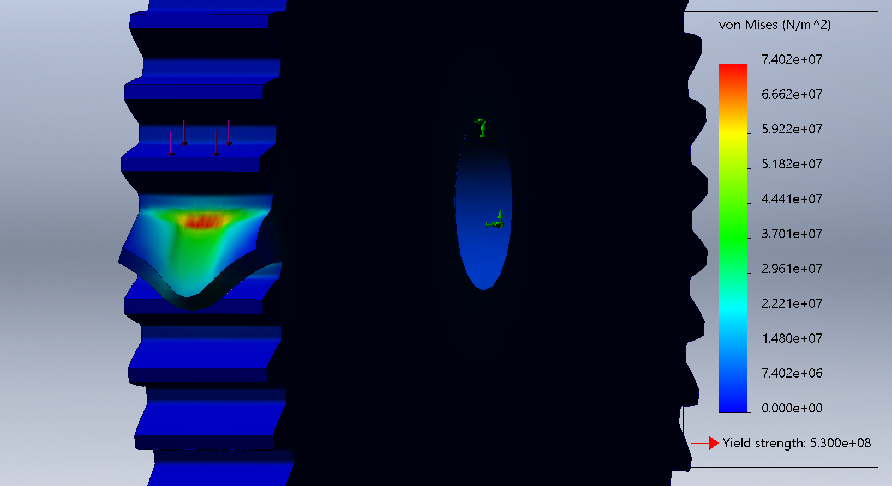

# Two Stage Spur Gearbox
This project involves a SolidWorks designed two stage reduction gearbox intended for robotic actuation applications. The gearbox reduces high speed motor input and increases torque whilst maintaining a compact size. Finite Element Analysis was also performed to ensure the systems reliability under the expected loading conditions.

# 1. System Overview

This demonstrates the motion of the gearbox including gears, shafts and bearings.

# 2. Features
- Two stage spur gear reduction gearbox
- 20:1 overall reduction ratio  
- Compact and accurate gear train layout  
- Fully modelled mechanical assembly in SolidWorks  
- Motion study for kinematic verification  
- Finite Element Analysis for structural everification  
- Engineering drawings and exploded assembly documentation  

# 3. Hardware
| Component | Description |
|----------|-------------|
| Spur Gears | Power transmission between shafts |
| Input Shaft | Receives high speed input |
| Intermediate Shaft | Transfers motion between gear stages |
| Output Shaft | Provides reduced speed and high torque output |
| Deep Groove Ball Bearings | Maintain shaft alignment and reduce friction |
| Gearbox Housing | Structural support and component alignment |

# 4. System Design
The gearbox consists of three shafts providing two reduction gear stages.

## 4.1 Mechanical System
The gear train transmits motion through two spur gear stages:

Stage 1  
12 tooth pinion → 60 tooth driven gear  
Reduction ratio = 5:1

Stage 2  
15 tooth pinion → 60 tooth driven gear  
Reduction ratio = 4:1

Overall gearbox reduction = 20:1

## 4.2 Structural System
The gearbox housing supports the bearings and maintains accurate alignment between meshing gears. Bearings constrain the shafts radially while allowing free rotational motion.

## 4.3 Motion System
Gear mates were used in SolidWorks to esnure reduction ratios between meshing gears. A motion study was performed to verify that rotational motion is correct.

# 5. Design Validation
## Motion Verification
A SolidWorks motion study was performed to confirm that the gearbox produces the intended 20:1 reduction ratio and that rotational motion is smooth and accurate.

## Structural Analysis
Finite Element Analysis (FEA) was performed on the gear with the highest expected load to evaluate stress distribution under expected loading conditions. Maximum stress occurs at the gear tooth root, consistent with expected spur gear behaviour.

# 6. Repository Structure
An overview of the files included in this repository:
- **'/CAD':** SolidWorks parts and assemblies
- **'/analysis':** Engineering calculations and validation
- **'/drawings':** Engineering drawings and exploded assembly
- **'/docs':** Project documentation
- **'/media':** Renders, animations and analysis images  
